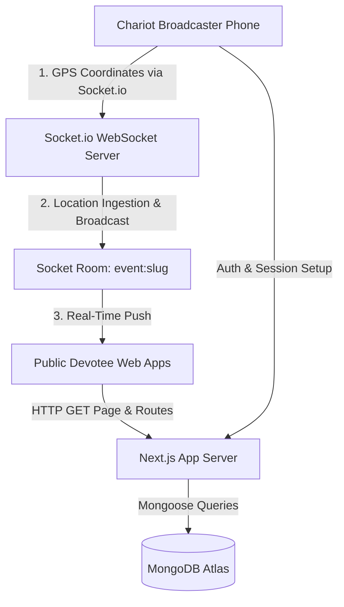

# Architecture Spine — pullydragged

## Design Paradigm
**pullydragged** is structured as an **Event-Driven Layered Web Application** with Next.js (App Router) handling SSR landing pages & REST APIs, coupled with a Node.js + Socket.io server for sub-second WebSocket room broadcasting.



---

## Invariants & Architectural Decisions

### AD-1 — Framework & Rendering Strategy [ADOPTED]
- **Binds:** FR-1, FR-2, FR-7
- **Prevents:** Client-side routing lag, missing SSR meta tags for social sharing, and window `ReferenceError` crashes during Leaflet map initialization.
- **Rule:** 
  1. Next.js 14+ (App Router) MUST be used for all web pages and API routes.
  2. Leaflet map components (`react-leaflet`) MUST be loaded dynamically on the client side with `{ ssr: false }`.

### AD-2 — Multi-Tenant Event Isolation & Routing [ADOPTED]
- **Binds:** FR-1, FR-3, FR-13, FR-15
- **Prevents:** Cross-city data contamination and accidental broadcast leaks between concurrent festival instances.
- **Rule:** 
  1. Every database record (Routes, Checkpoints, Announcements, Location Logs) MUST be indexed and scoped by `eventSlug` (e.g. `itahari`, `biratnagar`).
  2. Socket.io connections MUST join specific room channels (`event:<eventSlug>`) upon initialization.

### AD-3 — Live Location Ingestion & Resilience Protocol [ADOPTED]
- **Binds:** FR-4, FR-5, FR-6
- **Prevents:** Phone screen dimming/sleeping, lost location frames during crowd network drops, and excessive battery drain.
- **Rule:** 
  1. Broadcaster client MUST request Screen WakeLock API (`navigator.wakeLock.request('screen')`) upon starting broadcast.
  2. Location frames MUST be emitted every 3 seconds. If WebSocket connection drops, frames MUST be queued in local storage (`localStorage`/`IndexedDB`) and flushed in sequence upon reconnect.

### AD-4 — Polyline Nearest-Point Progress Calculation [ADOPTED]
- **Binds:** FR-8
- **Prevents:** Erratic progress bar jumps caused by raw GPS noise or minor off-path wanderings.
- **Rule:** 
  1. Route progress percentage (0.0% to 100.0%) MUST be calculated by projecting the incoming `(lat, lng)` point onto the pre-defined GeoJSON Route Polyline using a nearest-segment algorithm (`@turf/nearest-point-on-line`).

### AD-5 — Data Persistence & Storage Layer [ADOPTED]
- **Binds:** FR-10, FR-11, FR-13, FR-14
- **Prevents:** Rigid schema migration overhead when scaling to diverse global festival formats.
- **Rule:** 
  1. MongoDB Atlas + Mongoose ODM MUST be used for data persistence.
  2. Media URLs (checkpoint photos) MUST store public HTTPS URLs.

---

## Consistency Conventions

| Concern | Convention |
| --- | --- |
| Naming (Files & Routes) | `kebab-case` for file names and URL slugs (e.g. `/itahari`, `/biratnagar/broadcast`) |
| API Endpoints | `/api/v1/events`, `/api/v1/events/:slug/checkpoints`, `/api/v1/events/:slug/routes` |
| Socket.io Events | `broadcaster:location-update`, `server:chariot-moved`, `server:announcement-posted` |
| Coordinates Format | GeoJSON `[longitude, latitude]` for DB storage; `[latitude, longitude]` for Leaflet UI |
| Styling | Tailwind CSS v4 CSS-first theme directives (`@import "tailwindcss"`) |

---

## Stack

| Name | Version | Role |
| --- | --- | --- |
| **Next.js** | `14.2.x` | Web Framework (App Router, Server Actions, API Routes) |
| **React** | `18.3.x` | UI Library |
| **Tailwind CSS** | `v4.0.x` | Utility-First CSS Framework |
| **Leaflet / React-Leaflet** | `1.9.4` / `4.2.1` | Mobile Interactive Map Engine |
| **Socket.io / Socket.io-client** | `4.7.x` | Real-Time WebSocket Communication |
| **MongoDB / Mongoose** | `8.x` | Database & Object Data Modeling |
| **Turf.js (`@turf/turf`)** | `7.x` | Geospatial Calculations (Polyline Progress) |

---

## Structural Seed (Source Tree Scaffold)

```text
pullydragged/
├── app/
│   ├── globals.css                   # Tailwind v4 import directives
│   ├── page.tsx                      # Root active festival selector page
│   ├── [eventSlug]/
│   │   ├── page.tsx                  # Public Devotee Live Map View
│   │   ├── broadcast/
│   │   │   └── page.tsx              # Broadcaster GPS Stream Page
│   │   └── admin/
│   │       └── page.tsx              # Admin Route & Checkpoint Setup
│   └── api/
│       ├── events/route.ts           # CRUD Event Instances
│       ├── routes/route.ts           # CRUD GeoJSON Route Polylines
│       └── checkpoints/route.ts      # CRUD Checkpoint Cards & Announcements
├── components/
│   ├── map/
│   │   ├── LiveMap.tsx               # Leaflet Client Map (Dynamic Import: ssr false)
│   │   ├── RathMarker.tsx            # Animated Chariot Icon Marker
│   │   └── CheckpointMarker.tsx      # Checkpoint Pins & Modals
│   ├── ui/
│   │   ├── ProgressBar.tsx           # Route-Shaped Progress Bar
│   │   ├── CheckpointCard.tsx        # Bottom sheet / info card
│   │   └── AnnouncementToast.tsx     # Live updates banner
│   └── broadcaster/
│       └── LocationBroadcaster.tsx   # WakeLock & GPS Stream Manager
├── lib/
│   ├── db/
│   │   ├── mongodb.ts                # Mongoose connection cached instance
│   │   └── models/                   # Event, Route, Checkpoint, Announcement models
│   ├── geo/
│   │   └── progress.ts               # Turf.js nearest point on polyline progress math
│   └── socket/
│       ├── client.ts                 # Socket.io client hook/singleton
│       └── server.ts                 # Socket.io server room handler
```

---

## Capability → Architecture Map

| Capability / Area | Lives in | Governed by |
| --- | --- | --- |
| Multi-Event Routing (`/itahari`, `/biratnagar`) | `app/[eventSlug]/page.tsx` | AD-1, AD-2 |
| Live GPS Ingestion & WakeLock | `components/broadcaster/LocationBroadcaster.tsx` | AD-3 |
| Real-Time Map & Rath Icon | `components/map/LiveMap.tsx` | AD-1, AD-2 |
| Route Progress Bar Calculation | `lib/geo/progress.ts` | AD-4 |
| Checkpoint Cards & Live Announcements | `components/ui/CheckpointCard.tsx` | AD-2, AD-5 |

---

## Deferred Decisions

1. **Production WebSocket Hosting Platform**: Choice between custom Node.js server (Docker / Render / DigitalOcean) vs. serverless WebSocket gateway (e.g. Socket.io custom server container).
2. **Media Storage Provider**: Cloudinary vs. AWS S3 / Supabase Storage for high-res Checkpoint photo uploads (MVP can use direct HTTPS image URLs).
